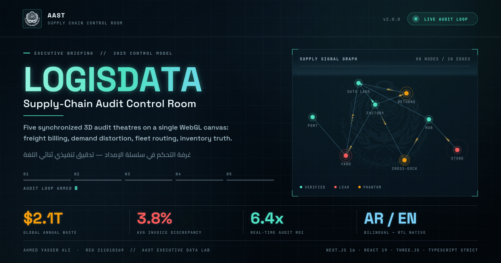
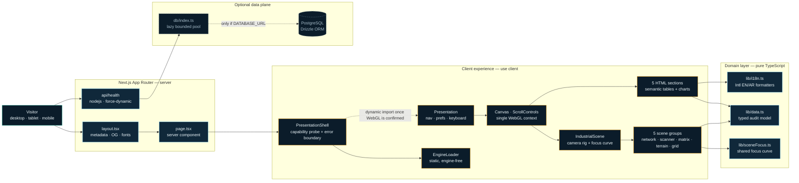
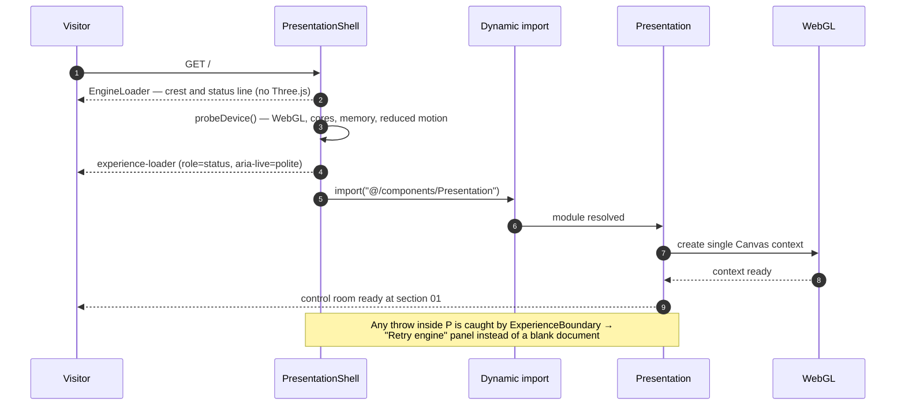
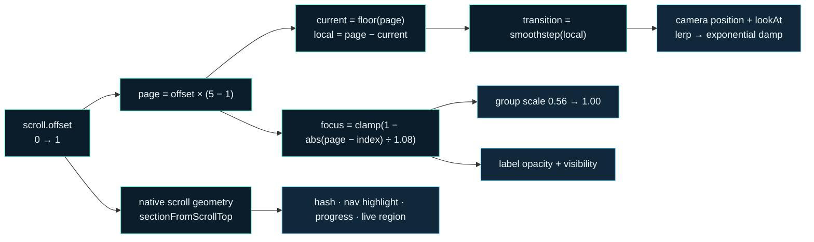
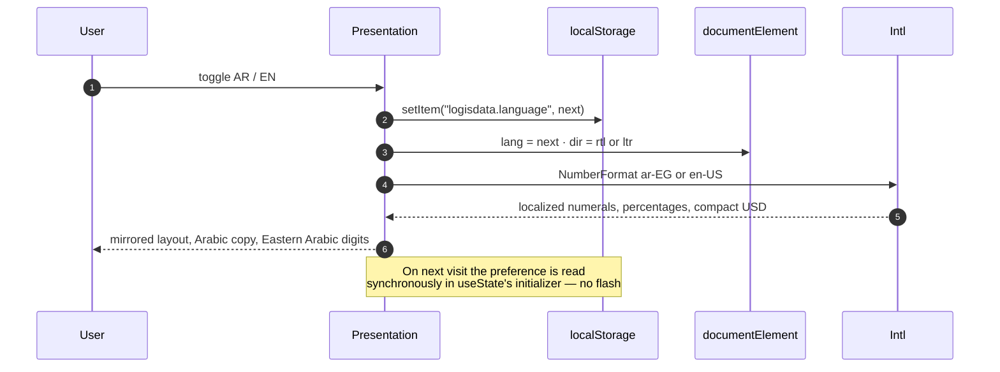
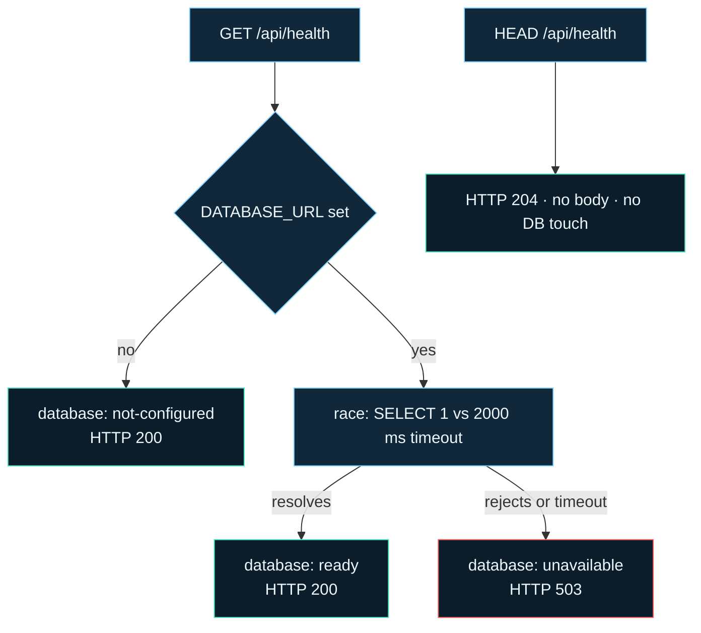

<div align="center">



<h1>LOGISDATA</h1>

<h3>Supply-Chain Audit Control Room</h3>

**One WebGL canvas. Five synchronized audit theatres. Two languages, one version of the truth.**

[](https://nextjs.org)
[](https://react.dev)
[](https://www.typescriptlang.org)
[](https://threejs.org)
[](https://nodejs.org)


[**Quickstart**](#-quickstart) · [**System Architecture**](#-system-architecture) · [**Feature Matrix**](#-feature-matrix) · [**Core Workflows**](#-core-workflows) · [**Tech Stack**](#-tech-stack) · [**Social Preview**](#-social-preview-pipeline)

</div>

---

> [!NOTE]
> **Abstract.** Supply-chain margin does not leak in one place — it leaks in the gap between four systems that each believe a different number. LOGISDATA is an executive audit instrument that puts those four disagreements on one canvas: freight billing versus telematics, consumer demand versus order amplification, planned routes versus GPS reality, and WMS master data versus what is physically on the shelf. It ships as a five-stage, scroll-choreographed control room with synchronized 3D operational models, full English/Arabic parity, and a hardened production posture.

---

## ▸ At a glance

| Dimension | Value | Engineering consequence |
| :--- | :--- | :--- |
| **Audit theatres** | 5 (hidden cost → invoice → bullwhip → routes → warehouse) | one narrative spine, one scroll container, one camera rig |
| **WebGL contexts** | 1 | all scenes stay mounted; transitions are transforms, not remounts |
| **Locales** | `en` / `ar` with native RTL | layout direction, numerals and currency invert at runtime |
| **Initial JS on first paint** | zero Three.js | the engine is code-split and loaded only once the device is known to support WebGL |
| **Runtime data fetches** | 0 on the critical path | the domain model is typed, static and tree-shaken |
| **Database** | optional | the presentation is fully functional with no `DATABASE_URL` |
| **Source surface** | 53 TypeScript/TSX modules (7,016 lines) + 3,138 lines of tokenized CSS | measured from `src/` on 2026-10-02 |
| **Automated coverage** | 213 passing unit tests + 60 configured Playwright checks | unit gates pass locally; browser checks run when Chromium is available |
| **Initial shell payload** | 202,619 B gzip | measured against the 205,000 B production budget |
| **Known vulnerabilities** | 0 (`npm audit`) | pinned toolchain plus an `esbuild` override |

---

## ▸ System Architecture

### Topology



### Runtime boundaries

The application is deliberately split into three cost tiers. The 3D tier is requested only after the client capability probe confirms that WebGL is available; there is no cover-screen CTA or intent gate.

| Tier | Boundary | Payload | Trigger |
| :--- | :--- | :--- | :--- |
| **T0 — Shell** | `page.tsx` → `PresentationShell` → `EngineLoader` | Static HTML, CSS, React shell, small icon subset | first paint |
| **T1 — Engine** | `dynamic(() => import("@/components/Presentation"), { ssr: false })` | React Three Fiber, drei, Three.js, Framer Motion, all five scenes | hydration, once the device probe confirms a WebGL context |
| **T2 — Data plane** | `getDb()` inside `api/health` | `pg` pool, Drizzle | a readiness request *and* a configured `DATABASE_URL` |

> [!IMPORTANT]
> `ssr: false` is a correctness requirement, not an optimization. The scene graph reads `window`, `document.visibilityState` and `localStorage` during initialization; server-rendering it would produce a hydration mismatch and a flash of unthemed content.

### The single-canvas contract

Five operational models share **one** `<Canvas>`, **one** camera and **one** scroll container. Section transitions are therefore pure transform interpolations — no WebGL context is created or destroyed while the user navigates.

```text
ScrollControls(pages = 5, damping = 0.12)
   │
   ├─ ScrollBridge ───────────► exposes scroll.el to React for programmatic nav
   ├─ DeckOverlay portal ─────► 5 semantic <section> elements in the native scroller
   │
   └─ IndustrialScene ────────► per-frame rig (useFrame)
         ├─ pagePosition     offset × (SECTION_COUNT − 1)
         ├─ camera.position  lerp(CAMERA_TARGETS[i], [i+1]) → damp(1 - e^(-4.6·Δt))
         ├─ camera.lookAt    lerp(LOOK_TARGETS[i],   [i+1]) → damp(1 - e^(-5.2·Δt))
         └─ group[i]         scale 0.56 + focus·0.44 · depth (i − pagePosition)·2.2
```

**The focus curve is the single source of truth for "how present is section _i_ right now".**

```ts
pagePosition = clamp(offset, 0, 1) × (SECTION_COUNT − 1)
focus(offset, i) = clamp(1 − |pagePosition − i| / 1.08, 0, 1)
```

`IndustrialScene` applies it to mesh scale; `FocusFadeLabel` applies the identical curve to label opacity through [`lib/sceneFocus.ts`](LOGISDATA/src/lib/sceneFocus.ts). Both consumers therefore stay aligned by construction—the regression tests lock the exact section peaks at offsets 0, 0.25, 0.5, 0.75, and 1.

### Module map

| Path | Responsibility | Contract |
| :--- | :--- | :--- |
| [`src/app/layout.tsx`](LOGISDATA/src/app/layout.tsx) | Document shell, font loading, Open Graph / Twitter metadata | Animated GIF card first, static PNG as fallback |
| [`src/app/page.tsx`](LOGISDATA/src/app/page.tsx) | Server entry | Renders the shell only — no client state |
| [`src/components/PresentationShell.tsx`](LOGISDATA/src/components/PresentationShell.tsx) | Capability probe ↔ engine handoff, `ExperienceBoundary` | A WebGL failure degrades to a retryable panel, never a white screen |
| [`src/components/Presentation.tsx`](LOGISDATA/src/components/Presentation.tsx) | Navigation, preferences, keyboard map, visibility gating | Owns all cross-cutting UI state |
| [`src/components/three/IndustrialScene.tsx`](LOGISDATA/src/components/three/IndustrialScene.tsx) | Camera rig, per-section transforms, section change events | Zero allocations inside `useFrame` |
| [`src/components/three/*`](LOGISDATA/src/components/three) | Five scene models + `FocusFadeLabel` | Read-only consumers of `lib/data.ts` |
| [`src/components/sections/*`](LOGISDATA/src/components/sections) | Accessible HTML analytics for each theatre | Semantic tables; never canvas-only content |
| [`src/lib/data.ts`](LOGISDATA/src/lib/data.ts) | The audit model: 3 metrics, 5 freight rows, 5 demand tiers, 5 route regions, 4 warehouse specs, 42 bins, 8 nodes, 10 edges | Every string is `{ en, ar }` |
| [`src/lib/i18n.ts`](LOGISDATA/src/lib/i18n.ts) | `text` / `number` / `integer` / `currency` via `Intl` | `en-US` and `ar-EG` numeral systems |
| [`src/lib/export.ts`](LOGISDATA/src/lib/export.ts) | Scenario-aware CSV and executive JSON evidence packages | Exported rows and summaries match the active scenario; JSON carries illustrative provenance |
| [`src/lib/useNativeDialog.ts`](LOGISDATA/src/lib/useNativeDialog.ts) | Shared native modal lifecycle | Initial focus, Escape/platform close, and invoker-focus restoration |
| [`src/lib/types.ts`](LOGISDATA/src/lib/types.ts) | Domain types | `LocalizedText` makes an untranslated string a compile error |
| [`src/db/index.ts`](LOGISDATA/src/db/index.ts) | Lazy, bounded PostgreSQL pool | Never constructed at import time |
| [`src/app/api/health/route.ts`](LOGISDATA/src/app/api/health/route.ts) | Liveness + optional readiness | Honest status codes — see [Operations](#-operations) |
| [`tools/og-image/`](tools/og-image) | Deterministic social-card renderer | Regenerates the animated GIF from design tokens |

---

## ▸ Feature Matrix

<table>
<thead>
<tr><th align="left">#</th><th align="left">Capability</th><th align="left">Surface</th><th align="left">Implementation</th><th align="left">State</th></tr>
</thead>
<tbody>

<tr><td colspan="5"><b>Experience</b></td></tr>
<tr><td>01</td><td>Five-stage audit narrative</td><td><code>sections/*</code></td><td>Full-viewport sections bound to a shared section index</td><td>✅ Shipped</td></tr>
<tr><td>02</td><td>Synchronized 3D models</td><td><code>three/*</code></td><td>Supply network, laser audit gate, demand matrix, route terrain, warehouse grid</td><td>✅ Shipped</td></tr>
<tr><td>03</td><td>Cinematic camera choreography</td><td><code>IndustrialScene</code></td><td>Dual-target interpolation with frame-rate-independent damping</td><td>✅ Shipped</td></tr>
<tr><td>04</td><td>Deferred engine boot</td><td><code>PresentationShell</code></td><td><code>next/dynamic</code> + <code>ssr:false</code> after the WebGL capability probe; no cover-screen CTA</td><td>✅ Shipped</td></tr>
<tr><td>05</td><td>Animated metric counters</td><td><code>MetricCounter</code></td><td><code>IntersectionObserver</code> (0.35) → rAF cubic ease-out over 1250 ms</td><td>✅ Shipped</td></tr>

<tr><td colspan="5"><b>Localization</b></td></tr>
<tr><td>06</td><td>English / Arabic parity</td><td><code>lib/data.ts</code></td><td>Every copy node is <code>LocalizedText</code>; the compiler enforces coverage</td><td>✅ Shipped</td></tr>
<tr><td>07</td><td>Native RTL inversion</td><td><code>Presentation</code></td><td><code>documentElement.dir</code> + <code>lang</code> flipped on toggle; CSS logical properties</td><td>✅ Shipped</td></tr>
<tr><td>08</td><td>Locale-correct numerals</td><td><code>lib/i18n.ts</code></td><td><code>Intl.NumberFormat</code> with <code>ar-EG</code> digits and compact USD</td><td>✅ Shipped</td></tr>
<tr><td>09</td><td>Arabic display typography</td><td><code>@fontsource-variable/cairo</code></td><td>Self-hosted variable font — no third-party font request</td><td>✅ Shipped</td></tr>

<tr><td colspan="5"><b>Accessibility</b></td></tr>
<tr><td>10</td><td>Keyboard navigation</td><td><code>Presentation</code></td><td>Arrows · Page Up/Down · Home · End, with modifier and text-field guards</td><td>✅ Shipped</td></tr>
<tr><td>11</td><td>Semantic analytics</td><td><code>sections/*</code></td><td>Real <code>&lt;table&gt;</code> markup, <code>aria-labelledby</code>, <code>aria-current="step"</code></td><td>✅ Shipped</td></tr>
<tr><td>12</td><td>Motion reduction</td><td><code>useReducedMotion</code></td><td>Programmatic scrolling drops to <code>behavior: "auto"</code></td><td>✅ Shipped</td></tr>
<tr><td>13</td><td>Visible focus states</td><td><code>globals.css</code></td><td><code>:focus-visible</code> outline on every interactive control</td><td>✅ Shipped</td></tr>

<tr><td colspan="5"><b>Performance</b></td></tr>
<tr><td>14</td><td>Background-tab suspension</td><td><code>Presentation</code></td><td><code>visibilitychange</code> → <code>frameloop="never"</code>: no GPU work when hidden</td><td>✅ Shipped</td></tr>
<tr><td>15</td><td>Tiered fill cost</td><td><code>Canvas</code></td><td>Device-derived DPR clamp, adaptive regression while scrolling, <code>alpha:false</code>, <code>powerPreference:"high-performance"</code></td><td>✅ Shipped</td></tr>
<tr><td>16</td><td>Allocation-free render loop</td><td><code>IndustrialScene</code></td><td>Module-level vectors + refs; no per-frame object churn</td><td>✅ Shipped</td></tr>
<tr><td>17</td><td>React-free label updates</td><td><code>FocusFadeLabel</code></td><td>Opacity written straight to the DOM node inside <code>useFrame</code></td><td>✅ Shipped</td></tr>

<tr><td colspan="5"><b>Resilience &amp; platform</b></td></tr>
<tr><td>18</td><td>Recoverable engine failure</td><td><code>ExperienceBoundary</code></td><td>Class boundary with a retry action and telemetry-friendly logging</td><td>✅ Shipped</td></tr>
<tr><td>19</td><td>Database-optional runtime</td><td><code>db/index.ts</code></td><td>Pool constructed lazily; importing the module never throws</td><td>✅ Shipped</td></tr>
<tr><td>20</td><td>Bounded connection pool</td><td><code>db/index.ts</code></td><td><code>max</code> clamped to 1–50, 5 s connect timeout, 30 s idle reap</td><td>✅ Shipped</td></tr>
<tr><td>21</td><td>Honest health contract</td><td><code>api/health</code></td><td><code>200</code> live · <code>503</code> only when a <i>configured</i> database is unreachable</td><td>✅ Shipped</td></tr>
<tr><td>22</td><td>Production security headers</td><td><code>next.config.ts</code></td><td>CSP plus eight defense headers, including HSTS preload in production builds</td><td>✅ Shipped</td></tr>
<tr><td>23</td><td>Animated social card</td><td><code>tools/og-image</code></td><td>Reproducible 1200×630 GIF + PNG fallback from design tokens</td><td>✅ Shipped</td></tr>
<tr><td>24</td><td>Scenario-consistent evidence</td><td><code>lib/export.ts</code></td><td>CSV rows and executive JSON summaries derive from the selected scenario; JSON includes illustrative provenance</td><td>✅ Shipped</td></tr>
<tr><td>25</td><td>Honest simulation state</td><td><code>LiveTelemetryFeed</code></td><td>Bilingual fixture-simulation disclosure; no interval or audio work while closed</td><td>✅ Shipped</td></tr>
<tr><td>26</td><td>Native modal lifecycle</td><td><code>useNativeDialog</code></td><td>Platform modality and Escape handling, deterministic initial focus, invoker-focus restoration</td><td>✅ Shipped</td></tr>
<tr><td>27</td><td>Calculator provenance</td><td><code>RecoveryCalculator</code> / <code>HandoutView</code></td><td>Bilingual fixed-assumption disclosure; illustrative, not a forecast</td><td>✅ Shipped</td></tr>
<tr><td>28</td><td>Context-safe global shortcuts</td><td><code>lib/keyboard.ts</code></td><td>Section keys yield to focused controls, IME composition, handled events, modifiers, and open modals</td><td>✅ Shipped</td></tr>
<tr><td>29</td><td>Accessible operating modes</td><td><code>ScenarioSwitcher</code> / <code>LiveTelemetryFeed</code></td><td>Roving radio focus, arrow/Home/End selection, localized pressed filters, and truthful running/paused status</td><td>✅ Shipped</td></tr>

</tbody>
</table>

---

## ▸ Core Workflows

### W-01 · Cold start and engine handoff

First paint must not depend on WebGL. The engine chunk is requested only after the preference/device probe confirms that the browser can create a rendering context, so a device that cannot run the deck does not request the Three.js chunk—it is served the `/handout` text briefing instead.



### W-02 · Scroll-driven camera choreography

One scroll offset drives the camera, every scene transform and every label's opacity — deriving all of them from a single number is what keeps 3D and HTML in lockstep at any frame rate.



**Guarantees**

- URL, navigation, progress, and live-region state derive from the native scroll event—not the GPU frame loop—so they remain correct when rendering is throttled or suspended.
- Damping uses `1 − e^(−k·Δt)`, which is frame-rate independent across 30, 60, and 144 Hz.
- `goToSection()` scrolls the real DOM container obtained through `ScrollBridge`, so keyboard, nav-chip, and progress-dot navigation all share one code path.

### W-03 · Bilingual inversion



Theme follows the same pattern against `logisdata.theme`, additionally setting `colorScheme` so native form controls and scrollbars match the active surface.

### W-04 · Freight invoice audit (the domain loop the product exists for)

| Step | Input | Control | Output |
| :--- | :--- | :--- | :--- |
| 1 | Contracted distance | Carrier rate agreement | `billedMileage` |
| 2 | Telematics distance | GPS / ELD stream | `actualMileage` |
| 3 | Duplicate detection | Invoice-line fingerprinting | `duplicateBillingPct` |
| 4 | Rate reconciliation | Tariff versus applied rate | `overchargePct` |
| 5 | Verdict | Threshold policy | `red-flag` \| `passed` |

The HTML table renders the ledger; the `AuditScanner` scene renders the same rows as a laser gate reconciling telemetry against contract. Both read the identical array — there is no "presentation copy" of the numbers that can drift from the model.

### W-05 · Health and readiness



> [!TIP]
> Point container **liveness** probes at `HEAD /api/health` (cheap, never touches the pool) and **readiness** probes at `GET`. A presentation with no database attached stays healthy by design — it is not degraded, it is simply stateless.

### W-06 · Social preview generation

```bash
cd tools/og-image && npm install
npm run build        # → LOGISDATA/public/og-image-animated.gif + og-image.png
```

The renderer reads the same tokens as `globals.css` and the same graph as `lib/data.ts`, so the card cannot drift from the product. See [Social preview pipeline](#-social-preview-pipeline).

---

## ▸ Tech Stack

### Application runtime

| Layer | Technology | Version | Why it is here |
| :--- | :--- | :--- | :--- |
| Framework | **Next.js** (App Router) | `^16.3.7` | Server components for the shell, route handlers for health, first-class code splitting for the engine boundary |
| UI runtime | **React** | `19.2.6` | Concurrent rendering; `useState` initializers read persisted preferences without a flash |
| Language | **TypeScript** | `5.9.3` | `strict: true`; `LocalizedText` turns a missing translation into a build failure |
| 3D | **Three.js** | `^0.185.1` | Industry-standard WebGL abstraction with a predictable memory model |
| 3D bindings | **@react-three/fiber** | `^9.7.0` | Declarative scene graph; `useFrame` for allocation-free animation |
| 3D helpers | **@react-three/drei** | `^10.7.7` | `ScrollControls`, `Scroll`, `Html`, `Line`, `Float` |
| Motion | **Framer Motion** | `^12.43.0` | Entry choreography plus `useReducedMotion` as a first-class input |
| Icons | **lucide-react** | `^1.48.0` | Tree-shaken SVG icons, no icon font |
| Styling | **Tailwind CSS 4** + CSS custom properties | `4.1.17` | Utility layer for structure, tokenized variables for theme and RTL |
| Typography | **Cairo Variable** | `^5.3.0` | One self-hosted variable face that covers Latin and Arabic |

### Data plane (optional)

| Layer | Technology | Version | Why it is here |
| :--- | :--- | :--- | :--- |
| ORM | **Drizzle ORM** | `0.45.2` | Typed SQL with zero runtime reflection |
| Driver | **node-postgres** | `8.20.0` | Explicit, bounded pooling with predictable timeouts |
| Migrations | **drizzle-kit** | `^0.31.11` | `schema.ts` is intentionally empty — the deck owns no tables yet |

### Toolchain and asset pipeline

| Layer | Technology | Version | Why it is here |
| :--- | :--- | :--- | :--- |
| Linting | **ESLint 9** flat config + `eslint-config-next` | `9.39.4` | Core Web Vitals ruleset, `.next`/`out`/`build` globally ignored |
| CSS build | **@tailwindcss/postcss** | `4.1.17` | Tailwind 4 pipeline without a legacy PostCSS chain |
| Supply chain | **`overrides.esbuild`** | `0.25.12` | Pins a transitive dependency to keep `npm audit` at zero findings |
| OG renderer | **@napi-rs/canvas** + **gifenc** | see [`tools/og-image`](tools/og-image) | Deterministic vector rasterization and a hand-tuned GIF encoder |

---

## ▸ Quickstart

**Requirements** — Node.js 22+, npm. A GPU is recommended but not required; the experience degrades gracefully through `ExperienceBoundary`.

```bash
git clone https://github.com/YASLOGIST/LOGISDATA.git
cd LOGISDATA/LOGISDATA
npm ci
npm run dev
```

Open **http://localhost:3000**. The deck loads straight into the overview section; individual stages are deep-linkable (`/#warehouse`).

<details>
<summary><b>Optional — attach PostgreSQL for readiness checks</b></summary>

<br>

```bash
cp .env.example .env.local
# edit DATABASE_URL, then restart the dev server
curl -s localhost:3000/api/health | jq
```

| Variable | Default | Purpose |
| :--- | :--- | :--- |
| `DATABASE_URL` | *(unset)* | Postgres connection string. Unset ⇒ `database: "not-configured"`, still `200`. |
| `DATABASE_POOL_MAX` | `10` | Pool ceiling, clamped to `1…50`. |
| `DATABASE_SSL` | `false` | `true` enables TLS with `rejectUnauthorized`. |
| `NEXT_PUBLIC_SITE_URL` | `http://localhost:3000` | `metadataBase` — drives absolute OG/Twitter image URLs. |

</details>

### Quality gates

| Command | Gate | Blocking |
| :--- | :--- | :--- |
| `npm run typecheck` | `tsc --noEmit` under `strict` | ✅ |
| `npm run lint` | ESLint flat config, Core Web Vitals | ✅ |
| `npm run build` | Production compile + route collection | ✅ |
| `npm audit` | Dependency advisories (currently **0**) | ✅ |
| `npm run test` | 213 Vitest tests in 16 files | ✅ |
| `npm run test:coverage` | 80% statements/branches/functions and 85% lines; current measured result 89.78% / 85.83% / 89.57% / 92.55% | ✅ |
| `npm run test:e2e` | 60 configured Playwright checks across desktop, reduced-motion and mobile—including axe accessibility and performance budgets; requires Chromium | ✅ when browser is available |
| `npm run budget` | Gzipped landing payload against a 205,000 B ceiling; current measured result 202,619 B | ✅ |
| `npm run check` | Types, lint, unit tests, and production build in sequence | ✅ |

---

## ▸ Operations

### Health endpoint contract

```http
GET /api/health            # readiness — Cache-Control: no-store
HEAD /api/health           # liveness  — 204, no body, no pool access
```

```json
{
  "ok": true,
  "service": "logisdata-control-room",
  "version": "3.1.0",
  "database": "ready | unavailable | not-configured",
  "uptimeSeconds": 42,
  "timestamp": "2026-10-02T19:42:00.000Z"
}
```

`version` defaults to `package.json` and can be replaced by a non-empty `NEXT_PUBLIC_APP_VERSION` deployment identifier.

| Situation | `database` | HTTP | Interpretation |
| :--- | :--- | :---: | :--- |
| No `DATABASE_URL` | `not-configured` | `200` | Stateless deck — healthy |
| `SELECT 1` succeeds | `ready` | `200` | Fully operational |
| Unreachable or >2 s | `unavailable` | `503` | Page the on-call, not the presenter |

### Security posture

Applied to every route by [`next.config.ts`](LOGISDATA/next.config.ts). Production responses carry nine security headers; API responses additionally carry `Cache-Control: no-store, max-age=0`.

| Header | Value | Threat addressed |
| :--- | :--- | :--- |
| `Content-Security-Policy` | self-origin defaults; objects/frames disabled; documented inline-script exception | Injection and embedding surface |
| `X-Content-Type-Options` | `nosniff` | MIME confusion |
| `X-Frame-Options` | `DENY` | Clickjacking |
| `Referrer-Policy` | `strict-origin-when-cross-origin` | Referrer leakage |
| `Permissions-Policy` | camera, microphone, geolocation, payment, usb = `()` | Silent capability acquisition |
| `Cross-Origin-Opener-Policy` | `same-origin` | Cross-origin window tampering |
| `Cross-Origin-Resource-Policy` | `same-origin` | Speculative cross-origin reads |
| `X-DNS-Prefetch-Control` | `on` | Explicit DNS-prefetch policy |
| `Strict-Transport-Security` | `max-age=63072000; includeSubDomains; preload` *(production only)* | Protocol downgrade |

`poweredByHeader` is disabled, `compress` is enabled and `reactStrictMode` is on.

---

## ▸ Social preview pipeline

The Open Graph card is not a screenshot — it is **compiled**, from the same tokens and the same graph data the product renders.

<div align="center">


</div>

| Property | Value |
| :--- | :--- |
| Primary asset | [`LOGISDATA/public/og-image-animated.gif`](LOGISDATA/public/og-image-animated.gif) |
| Static fallback | [`LOGISDATA/public/og-image.png`](LOGISDATA/public/og-image.png) |
| Geometry | `1200 × 630` (1.91:1 — Open Graph and `summary_large_image`) |
| Motion | 36 frames · 60 ms · **2.16 s seamless loop** |
| Colour | One global 255-colour table + **8×8 Bayer ordered dither** |
| Compression | Inter-frame delta with a transparent index and `dispose: 1` |
| Weight | ≈1.6 MB — inside Facebook, LinkedIn and X card limits |
| Build time | ≈1.5 s, deterministic (same input ⇒ same bytes) |
| Source | [`tools/og-image/generate-og.mjs`](tools/og-image/generate-og.mjs) |

**What animates — and why each element earns its place**

| Motion | Mirrors | Product meaning |
| :--- | :--- | :--- |
| Emerald gate sweeping left → right | `AuditScanner` laser gate | The audit pass itself |
| Metric digits scrambling, then a tick | `MetricCounter` | Simulated re-verification of an illustrative figure |
| Packets travelling the node graph | `SupplyNetwork` (the real 8 nodes / 10 edges) | Signal flow between facilities |
| Red and amber rings pulsing | `status: "leak" \| "phantom"` | Unverified nodes demanding attention |
| Five-segment rail illuminating 01 → 05 | The five sections | The narrative spine of the deck |
| Crest watermark and pill pulse | `HeroSection` lockup | Institutional provenance |

<details>
<summary><b>Engineering notes — how the file stays under 2 MB at 1200×630</b></summary>

<br>

1. **Supersampled vector rendering.** Every frame is drawn at 2× (2400×1260) and box-filtered down, so type and hairlines are antialiased without relying on a browser or GPU.
2. **Pixel-grid hairlines.** 1 px rules are placed on half-pixel centres at 1× so they survive downsampling as a single crisp pixel rather than a 2 px blur.
3. **One global palette.** Colours are fitted once across a stratified sample of frames, so no frame carries a local colour table.
4. **Ordered dithering, not error diffusion.** An 8×8 Bayer matrix at low amplitude removes gradient banding while preserving the long horizontal runs that LZW compresses — Floyd–Steinberg would look marginally smoother and roughly double the file.
5. **Delta frames.** Pixels identical to the previous frame are written as the transparent index with `dispose: 1`; typical frames mutate only 8–17% of the canvas.
6. **Deterministic noise.** The digit scramble uses a hash function rather than `Math.random`, so the asset is byte-reproducible and reviewable in a diff.
7. **Loop-closure invariant.** Every animated quantity is periodic over the loop, and the gate parks off-canvas for the final 18% — so frame 36 and frame 1 are visually identical and the loop has no seam.

```bash
cd tools/og-image
npm run build          # gif + png
npm run preview        # png only — fast design iteration
node generate-og.mjs --frame=13   # inspect any single frame
```

</details>

Metadata is wired in [`src/app/layout.tsx`](LOGISDATA/src/app/layout.tsx): the animated GIF is listed first for both `openGraph.images` and `twitter.images`, with the PNG immediately behind it for scrapers that cannot decode GIF. Set `NEXT_PUBLIC_SITE_URL` in production so both resolve to absolute URLs.

---

## ▸ Repository layout

```text
LOGISDATA/
├── README.md                    this whitepaper
├── LOGISDATA/                   the Next.js application
│   ├── public/
│   │   ├── og-image-animated.gif   animated social card (primary)
│   │   ├── og-image.png            static social card (fallback)
│   │   └── aast-logo.png           institutional crest
│   └── src/
│       ├── app/                 layout, page, globals.css, api/health
│       ├── components/          shell, presentation, sections/, three/, ui/
│       ├── db/                  lazy Drizzle + pg adapter
│       └── lib/                 data, i18n, sceneFocus, types
└── tools/
    └── og-image/                deterministic OG card renderer
```

---

## ▸ Data policy

> [!WARNING]
> Every figure in this deck is **illustrative and presentation-realistic** — modelled to be defensible in an executive conversation, not extracted from a production system. Validate against authoritative ERP, TMS, WMS, invoice and telematics sources before any operational or investment decision. The architecture is built so that swapping `lib/data.ts` for a live adapter changes no component contract.

---

<div align="center">

**Ahmed Yasser Ali** · Reg. `211010269`
Arab Academy for Science, Technology & Maritime Transport — Executive Data Lab

*Control the signal. Protect the margin.*

</div>
